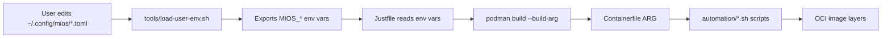

# MiOS Variables - Complete Reference

**Version:** 1.0.0
**Last Updated:** 2026-04-28
**Total Tracked Variables:** 15
**User-Ignitable Variables:** 10

---

## Quick Summary

MiOS tracks **15 variables** across the build and deployment pipeline:
- **10 user-editable** (configurable via TOML files)
- **5 system-managed** (auto-detected or derived)

All variables follow FHS 3.0 storage patterns and bootc/OCI compatibility.

---

## All User-Definable Variables

### 1. Image Selection Variables

| Variable | Default | File | Type | Security | Description |
|----------|---------|------|------|----------|-------------|
| **MIOS_BASE_IMAGE** | `ghcr.io/ublue-os/ucore-hci:stable-nvidia` | `images.toml` | Build-time | Low | Base OCI image to build from |
| **MIOS_IMAGE_NAME** | `ghcr.io/kabuki94/mios` | `images.toml` | Build-time | Low | Output image registry and name |
| **MIOS_BIB_IMAGE** | `quay.io/centos-bootc/bootc-image-builder:latest` | `images.toml` | Build-time | Low | bootc-image-builder container |

**Tracked Locations:**
```
MIOS_BASE_IMAGE:
  - Containerfile:19 (ARG BASE_IMAGE)
  - Justfile:45 (--build-arg)
  - @track:IMG_BASE

MIOS_IMAGE_NAME:
  - Justfile:9 (IMAGE_NAME)
  - mios-build-local.ps1:220 (MIOS_REGISTRY_DEFAULT)
  - @track:REGISTRY_DEFAULT

MIOS_BIB_IMAGE:
  - Justfile:14 (BIB)
  - mios-build-local.ps1:221
  - @track:IMG_BIB
```

**Alternatives for MIOS_BASE_IMAGE:**
- `ghcr.io/ublue-os/ucore-hci:stable` (No NVIDIA)
- `ghcr.io/ublue-os/ucore:stable` (Minimal, no GUI)
- `registry.fedoraproject.org/fedora-bootc:rawhide` (Fedora vanilla)

---

### 2. User Provisioning Variables

| Variable | Default | File | Type | Security | Description |
|----------|---------|------|------|----------|-------------|
| **MIOS_USER** | `mios` | `env.toml` | Build-time | Low | Default username baked into image |
| **MIOS_PASSWORD_HASH** | `` | `env.toml` | Build-time | **CRITICAL** | SHA-512 password hash |
| **MIOS_HOSTNAME** | `mios` | `env.toml` | Runtime | Low | System hostname |

**Tracked Locations:**
```
MIOS_USER:
  - Containerfile:55 (ARG)
  - automation/31-user.sh
  - mios-build-local.ps1:216

MIOS_PASSWORD_HASH:
  - Containerfile:56 (ARG)
  - automation/31-user.sh
  - mios-build-local.ps1:476 (--build-arg)
  - Placeholder: INJ_PASSWORD_HASH

MIOS_HOSTNAME:
  - Containerfile:57 (ARG)
  - automation/32-hostname.sh
  - Runtime override: hostnamectl set-hostname <name>
```

**Generate Password Hash:**
```bash
python3 -c "import crypt; print(crypt.crypt('mypassword', crypt.mksalt(crypt.METHOD_SHA512)))"
```

**Output Example:**
```
$6$randomsalt$hashvaluehere...
```

---

### 3. Package Selection Variables

| Variable | Default | File | Type | Security | Description |
|----------|---------|------|------|----------|-------------|
| **MIOS_FLATPAKS** | `` | `flatpaks.list` | Build-time | Low | Flatpak app IDs to pre-install |

**Tracked Locations:**
```
MIOS_FLATPAKS:
  - Containerfile:58 (ARG)
  - Containerfile:64-66 (RUN - inject into flatpak-list)
  - Justfile:46 (--build-arg)
  - usr/libexec/mios-flatpak-install.sh
  - .mios-variables:30
```

**Format:**
- **Build-time:** Comma-separated string: `org.mozilla.Firefox,org.gnome.Boxes`
- **File format:** One app ID per line:
  ```
  org.mozilla.Firefox
  org.gnome.Boxes
  com.visualstudio.code
  ```

**Runtime Addition:**
```bash
flatpak install -y org.mozilla.Firefox
```

---

### 4. AI Configuration Variables

| Variable | Default | File | Type | Security | Description |
|----------|---------|------|------|----------|-------------|
| **MIOS_AI_KEY** | `` | `ai.env` | Runtime | **CRITICAL** | API key for AI services |
| **MIOS_AI_MODEL** | `llama3.1:8b` | `env.toml` | Runtime | Low | AI model to use |
| **MIOS_AI_ENDPOINT** | `http://localhost:8080/v1` | `env.toml` | Runtime | Low | AI API endpoint URL |
| **MIOS_AI_TEMPERATURE** | `0.7` | `env.toml` | Runtime | Low | AI temperature parameter |

**Tracked Locations:**
```
MIOS_AI_KEY:
  - .ai/context.json
  - specs/ai-integration/2026-04-27-Artifact-AI-006-Unified-Redirects.md
  - Storage: ~/.config/mios/ai.env (mode 600, never committed)

MIOS_AI_MODEL:
  - .ai/context.json
  - .ai/rag-config.yaml
  - tools/generate-ai-manifest.py:10

MIOS_AI_ENDPOINT:
  - .ai/context.json
  - .ai/rag-config.yaml

MIOS_AI_TEMPERATURE:
  - .ai/context.json (default: 0.7)
  - User configurable in env.toml
```

**AI Model Examples:**
- **Ollama:** `llama3.1:8b`, `llama3.1:70b`, `qwen2.5:72b`
- **OpenAI:** `gpt-4`, `gpt-4-turbo`, `gpt-3.5-turbo`
- **Anthropic:** `claude-3-opus`, `claude-3-sonnet`
- **Local:** `mistral:7b`, `codellama:13b`

---

### 5. Version and Build Variables

| Variable | Default | File | Type | Security | Description |
|----------|---------|------|------|----------|-------------|
| **MIOS_VAR_VERSION** | `0.1.3` | `VERSION` | Build-time | Low | MiOS version number |

**Tracked Locations:**
```
MIOS_VAR_VERSION:
  - Justfile:11 (MIOS_VAR_VERSION)
  - VERSION file
  - @track:VAR_VERSION
  - Managed by: push-to-github.ps1
```

**User Editable:** ❌ (system-managed, auto-bumped by release scripts)

---

## System-Managed Variables (Auto-Detected)

These variables are **NOT user-editable** and are automatically detected or derived:

| Variable | Source | Storage | Description |
|----------|--------|---------|-------------|
| **MIOS_ROLE** | Auto-detected | `/var/lib/mios/state/role` | System role: `desktop` \| `k3s` \| `ha` |
| **GPU_VENDOR** | Auto-detected | `/var/lib/mios/state/gpu` | GPU vendor: `nvidia` \| `amd` \| `intel` \| `none` |
| **MIOS_PLATFORM** | `systemd-detect-virt` | `/var/lib/mios/state/platform` | Virtualization platform |
| **PACKAGES_MD** | Build-time | Image layer | Package SSOT hash |
| **MIOS_BUILD_STATE** | Build-time | Build log | Build success/failure state |

---

## Variable Storage Locations (FHS 3.0)

### Build-Time Immutable (`/usr/share/mios/`)

```
/usr/share/mios/
├── PACKAGES.md          # Package SSOT (tracked: PACKAGES_MD hash)
├── defaults.env         # Default variable values
├── flatpak-list         # Default Flatpak apps
└── VERSION              # MiOS version (MIOS_VAR_VERSION)
```

**Mutability:** Immutable (baked into OCI image)
**Layer:** OCI image layer

---

### System Configuration (`/etc/mios/`)

```
/etc/mios/
├── runtime.env          # Runtime environment variables
│                        # Contains: MIOS_AI_ENDPOINT, MIOS_AI_MODEL, MIOS_ROLE
└── templates/           # Default TOML templates (read-only)
    ├── default.env.toml
    ├── default.images.toml
    ├── default.build.toml
    └── flatpaks.list
```

**Mutability:** Admin-editable
**Survives:** `bootc upgrade` (persistent overlay)

---

### User Configuration (`~/.config/mios/`)

```
~/.config/mios/
├── env.toml             # User environment config
│                        # Contains: MIOS_USER, MIOS_HOSTNAME, MIOS_AI_*
├── images.toml          # User image selections
│                        # Contains: MIOS_BASE_IMAGE, MIOS_IMAGE_NAME, MIOS_BIB_IMAGE
├── build.toml           # User build preferences
│                        # Contains: build options, cache settings
├── flatpaks.list        # User Flatpak list
│                        # Contains: MIOS_FLATPAKS (one per line)
└── ai.env               # AI secrets (mode 600, never committed)
                         # Contains: MIOS_AI_KEY
```

**Mutability:** User-editable
**Layer:** XDG Base Directory (user home)

---

### System State (`/var/lib/mios/state/`)

```
/var/lib/mios/state/
├── role                 # Detected role (MIOS_ROLE)
├── gpu                  # Detected GPU (GPU_VENDOR)
└── platform             # Detected platform (MIOS_PLATFORM)
```

**Mutability:** System-managed (auto-detected by automation/*-detect.sh)
**Layer:** Persistent state

---

## Variable Propagation Flow

### Build Entry Points



**Step-by-Step:**
1. User edits `~/.config/mios/env.toml`
2. `tools/load-user-env.sh` parses TOML files
3. Exports as `MIOS_*` environment variables
4. `Justfile` reads via `env_var_or_default()`
5. Passes to `podman build --build-arg`
6. `Containerfile` receives as `ARG` directives
7. `automation/*.sh` scripts read from `ARG`
8. Values baked into OCI image layers

---

### Runtime Propagation

```mermaid
graph LR
    A[/etc/mios/runtime.env] --> B[systemd EnvironmentFile]
    B --> C[systemd units]
    D[/usr/lib/profile.d/mios-env.sh] --> E[shell sessions]
    F[~/.config/mios/ai.env] --> G[AI services]
```

**Step-by-Step:**
1. `/etc/mios/runtime.env` loaded by systemd
2. Variables available in all systemd units
3. `/usr/lib/profile.d/mios-env.sh` sourced by shells
4. Variables available in user sessions
5. `~/.config/mios/ai.env` read by AI harness

---

## @track: Marker System

Variables with `@track:MARKER` comments are automatically tracked across multiple files.

### Example: MIOS_BASE_IMAGE

```dockerfile
# Containerfile:19
ARG BASE_IMAGE=ghcr.io/ublue-os/ucore-hci:stable-nvidia # @track:IMG_BASE
```

```just
# Justfile:45
--build-arg BASE_IMAGE={{env_var_or_default("MIOS_BASE_IMAGE", "ghcr.io/ublue-os/ucore-hci:stable-nvidia")}}
```

```json
// .ai/variables.json
{
  "tracked_in": [
    "Containerfile:19",
    "Justfile:45"
  ],
  "marker": "@track:IMG_BASE"
}
```

**Purpose:** AI agents know all locations to update when changing this variable.

**All @track: Markers:**
- `@track:IMG_BASE` → MIOS_BASE_IMAGE
- `@track:REGISTRY_DEFAULT` → MIOS_IMAGE_NAME
- `@track:IMG_BIB` → MIOS_BIB_IMAGE
- `@track:VAR_VERSION` → MIOS_VAR_VERSION
- `@track:USER_ADMIN` → MIOS_USER (default)
- `@track:IMG_RECHUNK` → MIOS_IMG_RECHUNK

---

## Variable Taxonomy

### Build-Time Variables
**Mutability:** Immutable in final OCI image
**Set during:** `podman build` execution
**Storage:** Containerfile ARG → Image layers

| Variable | Tracked | User-Editable |
|----------|---------|---------------|
| MIOS_BASE_IMAGE | ✅ | ✅ |
| MIOS_IMAGE_NAME | ✅ | ✅ |
| MIOS_BIB_IMAGE | ✅ | ✅ |
| MIOS_USER | ✅ | ✅ |
| MIOS_PASSWORD_HASH | ✅ | ✅ |
| MIOS_FLATPAKS | ✅ | ✅ |
| MIOS_VAR_VERSION | ✅ | ❌ |
| PACKAGES_MD | ❌ | ❌ |

---

### Runtime Variables
**Mutability:** Mutable after deployment
**Set during:** System boot / user session
**Storage:** `/etc/mios/runtime.env`, `~/.config/mios/*.toml`

| Variable | Tracked | User-Editable |
|----------|---------|---------------|
| MIOS_HOSTNAME | ✅ | ✅ |
| MIOS_AI_KEY | ✅ | ✅ |
| MIOS_AI_MODEL | ✅ | ✅ |
| MIOS_AI_ENDPOINT | ✅ | ✅ |
| MIOS_AI_TEMPERATURE | ✅ | ✅ |
| MIOS_ROLE | ❌ | ❌ (auto-detected) |
| GPU_VENDOR | ❌ | ❌ (auto-detected) |
| MIOS_PLATFORM | ❌ | ❌ (auto-detected) |

---

## Configuration File Examples

### ~/.config/mios/env.toml

```toml
[mios]
user = "myusername"
hostname = "my-workstation"

[ai]
model = "llama3.1:70b"
endpoint = "http://localhost:8080/v1"
temperature = 0.7
```

**Variables Defined:**
- `MIOS_USER = "myusername"`
- `MIOS_HOSTNAME = "my-workstation"`
- `MIOS_AI_MODEL = "llama3.1:70b"`
- `MIOS_AI_ENDPOINT = "http://localhost:8080/v1"`
- `MIOS_AI_TEMPERATURE = 0.7`

---

### ~/.config/mios/images.toml

```toml
[base]
image = "ghcr.io/ublue-os/ucore-hci:stable-nvidia"

[builder]
image = "quay.io/centos-bootc/bootc-image-builder:latest"

[output]
name = "ghcr.io/myuser/mios"
tag = "latest"
```

**Variables Defined:**
- `MIOS_BASE_IMAGE = "ghcr.io/ublue-os/ucore-hci:stable-nvidia"`
- `MIOS_BIB_IMAGE = "quay.io/centos-bootc/bootc-image-builder:latest"`
- `MIOS_IMAGE_NAME = "ghcr.io/myuser/mios"`

---

### ~/.config/mios/flatpaks.list

```
org.mozilla.Firefox
org.gnome.Boxes
com.visualstudio.code
io.podman_desktop.PodmanDesktop
```

**Variables Defined:**
- `MIOS_FLATPAKS = "org.mozilla.Firefox,org.gnome.Boxes,com.visualstudio.code,io.podman_desktop.PodmanDesktop"`

---

### ~/.config/mios/ai.env

```bash
# MiOS AI Configuration (SECRETS - DO NOT COMMIT)
MIOS_AI_KEY="sk-proj-xxxxxxxxxxxxxx"
```

**Variables Defined:**
- `MIOS_AI_KEY = "sk-proj-xxxxxxxxxxxxxx"`

**File Permissions:** `chmod 600 ~/.config/mios/ai.env`

---

## Security Considerations

### Critical Variables (Never Commit)

| Variable | Storage | Reason |
|----------|---------|--------|
| MIOS_PASSWORD_HASH | `env.toml` or build-arg only | User password hash |
| MIOS_AI_KEY | `ai.env` (mode 600) | AI API key |

**Protection:**
- `ai.env` automatically `.gitignore`'d
- Password hash only passed via `--build-arg` (not persisted in image)
- Secrets stored in `/run/secrets/` (tmpfs, runtime only)

---

### Placeholder System

Templates use placeholders for sensitive data:

| Placeholder | Variable | Usage |
|-------------|----------|-------|
| `INJ_PASSWORD_HASH` | MIOS_PASSWORD_HASH | Password hash injection |
| `INJ_USERNAME` | MIOS_USER | Username injection |
| `INJ_API_KEY` | MIOS_AI_KEY | API key injection |

**Example:**
```bash
# Template
useradd -m -p INJ_PASSWORD_HASH INJ_USERNAME

# After substitution
useradd -m -p $6$randomsalt$hash... myusername
```

---

## AI API Integration

### Query Variable Metadata

```json
{
  "function": "mios_variable_get",
  "parameters": {
    "variable_name": "MIOS_BASE_IMAGE",
    "scope": "build_time"
  },
  "returns": {
    "name": "MIOS_BASE_IMAGE",
    "value": "ghcr.io/ublue-os/ucore-hci:stable-nvidia",
    "default": "ghcr.io/ublue-os/ucore-hci:stable-nvidia",
    "mutability": "build_time",
    "tracked_in": ["Containerfile:19", "Justfile:45"],
    "user_editable": true,
    "marker": "@track:IMG_BASE"
  }
}
```

---

### Modify Variable

```json
{
  "function": "mios_variable_set",
  "parameters": {
    "variable_name": "MIOS_AI_MODEL",
    "value": "llama3.1:70b",
    "scope": "user_config"
  },
  "returns": {
    "status": "success",
    "message": "Updated ~/.config/mios/env.toml: ai.model = \"llama3.1:70b\""
  }
}
```

---

## Quick Reference Commands

### List All Variables

```bash
# Show all MIOS_* environment variables
env | grep '^MIOS_' | sort
```

---

### Load User Environment

```bash
# Source user configuration
source ./tools/load-user-env.sh

# Check loaded variables
env | grep '^MIOS_'
```

---

### Edit Configuration Files

```bash
# Environment configuration
vim ~/.config/mios/env.toml

# Image configuration
vim ~/.config/mios/images.toml

# Flatpak list
vim ~/.config/mios/flatpaks.list

# AI secrets
vim ~/.config/mios/ai.env
```

---

### Build with Custom Variables

```bash
# Method 1: Edit config files first
vim ~/.config/mios/images.toml
just build

# Method 2: Override via environment variables
MIOS_BASE_IMAGE="registry.fedoraproject.org/fedora-bootc:rawhide" just build

# Method 3: Direct podman build-arg
podman build --build-arg BASE_IMAGE="ghcr.io/ublue-os/ucore:stable" -t localhost/mios:latest .
```

---

## Variable Summary Table

| # | Variable | Default | File | Type | User-Editable | Tracked | Security |
|---|----------|---------|------|------|---------------|---------|----------|
| 1 | MIOS_BASE_IMAGE | `ghcr.io/ublue-os/ucore-hci:stable-nvidia` | `images.toml` | Build | ✅ | ✅ | Low |
| 2 | MIOS_IMAGE_NAME | `ghcr.io/kabuki94/mios` | `images.toml` | Build | ✅ | ✅ | Low |
| 3 | MIOS_BIB_IMAGE | `quay.io/centos-bootc/bootc-image-builder:latest` | `images.toml` | Build | ✅ | ✅ | Low |
| 4 | MIOS_USER | `mios` | `env.toml` | Build | ✅ | ✅ | Low |
| 5 | MIOS_PASSWORD_HASH | `` | `env.toml` | Build | ✅ | ✅ | **Critical** |
| 6 | MIOS_HOSTNAME | `mios` | `env.toml` | Runtime | ✅ | ✅ | Low |
| 7 | MIOS_FLATPAKS | `` | `flatpaks.list` | Build | ✅ | ✅ | Low |
| 8 | MIOS_AI_KEY | `` | `ai.env` | Runtime | ✅ | ✅ | **Critical** |
| 9 | MIOS_AI_MODEL | `llama3.1:8b` | `env.toml` | Runtime | ✅ | ✅ | Low |
| 10 | MIOS_AI_ENDPOINT | `http://localhost:8080/v1` | `env.toml` | Runtime | ✅ | ✅ | Low |
| 11 | MIOS_VAR_VERSION | `0.1.3` | `VERSION` | Build | ❌ | ✅ | Low |
| 12 | MIOS_ROLE | (auto) | `/var/lib/mios/state/role` | Runtime | ❌ | ❌ | Low |
| 13 | GPU_VENDOR | (auto) | `/var/lib/mios/state/gpu` | Runtime | ❌ | ❌ | Low |
| 14 | MIOS_PLATFORM | (auto) | `/var/lib/mios/state/platform` | Runtime | ❌ | ❌ | Low |
| 15 | PACKAGES_MD | (auto) | Image layer | Build | ❌ | ❌ | Low |

**Legend:**
- ✅ Yes
- ❌ No (system-managed)
- **(auto)** Auto-detected
- **Critical** = Never commit to version control

---

## Related Documentation

- [.ai/variables.json](../.ai/variables.json) - Complete variable metadata (JSON)
- [.ai/filesystem-structure.yaml](../.ai/filesystem-structure.yaml) - FHS storage locations
- [VARIABLES.md](../VARIABLES.md) - User-friendly variable guide
- [tools/load-user-env.sh](../tools/load-user-env.sh) - TOML parser and environment loader
- [Containerfile](../Containerfile) - Build-time ARG variables
- [Justfile](../Justfile) - Build entry point with `env_var_or_default()`

---

**Generated:** 2026-04-28
**Version:** 1.0.0
**Total Variables:** 15 tracked, 10 user-editable
